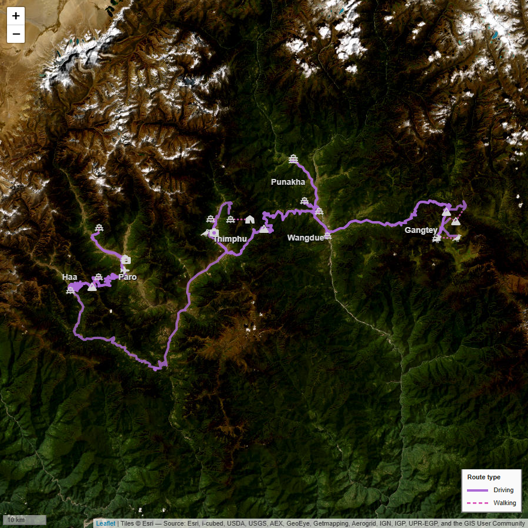

# Two Weeks in Bhutan

An interactive travel map built with R and Quarto, documenting a two-week holiday in Bhutan in April 2026.

🌐 **[View the project](https://sburgess2.github.io/Bhutan2026/)**

---

## About

This project visualises a travel route through Bhutan using two interactive maps to explore the terrain and each town visited. 

---

## Built with

---

